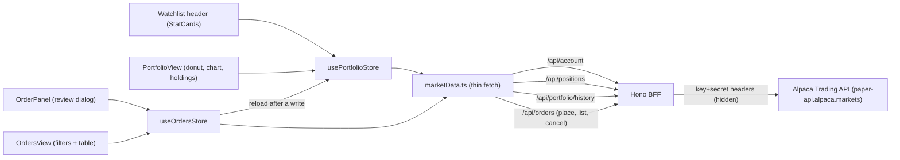

# 04 — Architecture

> This describes the intended structure. It will evolve once scaffolding begins.

## High-level

- **Single Page Application (SPA)** built with Vite.
- **Vue Router** for page navigation.
- **Pinia** stores for state; a **service layer** abstracts data access
  (mock → frontend-direct → backend-for-frontend).
- **Component-driven**: a responsive layout shell + reusable presentational components.
- **Full-stack target**: a thin **backend-for-frontend (BFF)** integrates external
  providers (Alpaca for trading, a market-data provider for quotes/search).

## Proposed folder structure

```
src/
├── assets/              # static assets, global styles
├── components/
│   ├── layout/          # AppSidebar, AppBottomNav, AppTopbar, SymbolSearch, UserMenu
│   ├── common/          # PriceTag, Sparkline, StatCard, DataTable wrappers
│   ├── watchlist/       # SymbolRow, SymbolCard
│   ├── portfolio/       # AllocationDonut, HoldingsTable
│   ├── chart/           # PriceChart, OrderPanel, TimeframeTabs
│   ├── orders/          # OrdersTable
│   └── markets/         # IndexCard, MoversTable, SectorHeatmap
├── views/               # route-level pages (Watchlist, Portfolio, Orders, Chart, Markets, Settings)
├── stores/              # Pinia stores
├── services/            # data-access boundary
│   ├── marketData.ts    # REST: symbol search + quotes (mock → provider → BFF)
│   ├── marketStream.ts  # WebSocket: real-time trade stream (frontend-direct → BFF)
│   └── trading.ts       # Alpaca via BFF (orders, positions, account) — later
├── composables/         # useBreakpoint, useFormatCurrency, etc.
├── types/               # shared TypeScript types (Symbol, Quote, Holding, Order, ...)
├── router/              # Vue Router config
└── App.vue / main.ts
```

The backend-for-frontend lives outside `src/`, deployed alongside the SPA. As of
Phase 10 it's a Hono app covering search + quotes + candles + markets +
account/positions/history + orders:

```
server/                  # backend-for-frontend (BFF) — Hono
├── index.ts             # Hono app + node-server: /api/health, /api/search, /api/quotes,
│                        #   /api/candles, /api/markets/{clock,indices,movers,sectors},
│                        #   /api/account, /api/positions, /api/portfolio/history,
│                        #   /api/orders (GET + POST), /api/orders/:id (GET + DELETE)
├── finnhub.ts           # server-side Finnhub client + mapping (search + quotes; holds the REST key)
├── alpacaClient.ts      # shared Alpaca transport: hosts, credentials, alpacaRequest(), num()
├── alpaca.ts            # candles (data host) + account/positions/history/orders (trading host)
├── markets.ts           # Markets page: index proxies, screener + filtering, sectors, clock (ADR-020)
├── cache.ts             # shared TTL cache (search ~1h, quotes ~10s, candles ~30s–5m, account/positions ~5s,
│                        #   history ~30s, orders ~2s, markets ~30–60s, assets ~24h) + invalidate() after writes
└── errors.ts            # shared ProviderError (status + message) for consistent /api responses
```

Orders are the only **write** path. Alpaca's `403` (insufficient buying power) and `422`
(bad params) keep their status and message so the UI can show the real reason, and every
write invalidates the account/positions/history/orders cache entries (ADR-018).

Alpaca spans **two hosts**: market data (`data.alpaca.markets`) for candles, snapshots and
screeners, and the Trading API (`paper-api.alpaca.markets`) for account, positions, orders,
assets and the market clock — same key/secret, different base URLs (`ALPACA_DATA_URL` /
`ALPACA_TRADING_URL`), shared by `alpaca.ts` and `markets.ts` through `alpacaClient.ts`.

The **Markets** page is Alpaca-only: Finnhub's free tier is US-only and has no screener, so
index cards use ETF proxies and Canada uses NYSE dual-listings (ADR-020).

In dev, **Vite proxies `/api/*` → the BFF** (`vite.config.ts`, default `PORT` 8787),
so the browser makes same-origin calls and never sees the provider keys.

## Routing (pages)

| Path | View | Notes |
| --- | --- | --- |
| `/` | Dashboard/Watchlist | Default landing (decision: dedicated Home vs Watchlist) |
| `/watchlist` | Watchlist | Followed symbols |
| `/portfolio` | Portfolio | Holdings + allocation + performance |
| `/orders` | Orders | Paper order activity, status filters, cancel |
| `/chart/:symbol` | Chart | Single-symbol chart + order panel |
| `/markets` | Markets | Indices, movers, sectors |
| `/settings` | Settings | Theme, preferences |

## Pinia stores (initial)

| Store | Responsibility |
| --- | --- |
| `useUiStore` | Theme, sidebar collapsed/expanded, active breakpoint |
| `useWatchlistStore` | Watchlist symbols + quotes (persisted; interim `localStorage`); owns the live-stream lifecycle and applies buffered trades |
| `useSearchStore` | Symbol search query + results (guards against out-of-order responses) |
| `usePortfolioStore` | Holdings, cash, derived P/L (mock → Alpaca positions) |
| `useMarketsStore` | Index cards, movers and sectors per region, plus the market clock (polls only while open) |
| `useOrdersStore` | Order placement, cancellation, and status polling (via BFF) |

> A `useUiStore` for layout state is what makes the responsive sidebar ↔ bottom-nav
> toggle clean and centralized.

## Key reusable components

- `PriceTag` — formats a number, colors it green/red, adds an up/down arrow. Used everywhere.
- `Sparkline` — tiny inline SVG trend chart for tables/cards.
- `StatCard` — labeled metric (portfolio value, day change).
- `SymbolRow` / `SymbolCard` — table row on desktop, card on mobile.
- `PriceChart` — the large candlestick chart (lightweight-charts).

## Data flow

```
View → Pinia store → Service layer → (mock JSON | frontend-direct | BFF)
                ↑ derived getters (P/L, totals)
```

The service layer is the seam that lets the data source evolve in three stages
**without touching views or components**.

## Symbol search

Adding a symbol to the watchlist starts with a type-ahead search in the top bar:

```
SymbolSearch (AutoComplete) → useSearchStore.search() → marketData.searchSymbols() → /api/search → BFF → Finnhub /search
                            ↳ select result → useWatchlistStore.add()
```

- **`SymbolSearch.vue`** (`components/layout/`) wraps PrimeVue `AutoComplete`. It
  debounces input via the `delay` prop, renders each result (symbol, name, type) with
  an "Added" tag when it's already followed, and on select delegates to
  `useWatchlistStore.add()` and shows a toast.
- **`useSearchStore`** runs the request and holds `query` / `results` / `loading` /
  `error`. It stamps each request with a sequence number so **out-of-order responses
  from earlier keystrokes are ignored** (only the latest query wins).
- **`marketData.searchSymbols()`** is a thin `fetch('/api/search?q=')` wrapper (Phase 6).
  The BFF (`server/finnhub.ts`) calls Finnhub `/search`, filters to clean US listings,
  and caches results so the dropdown stays lookup-able without burning quota. Quotes work
  the same way: `marketData.fetchQuotes()` → `GET /api/quotes?symbols=` (batched + cached
  server-side), then the client attaches each watchlist display name.

## Real-time streaming (WebSocket)

Live prices come from Finnhub's trade stream, kept behind the same service seam as REST:

```
marketStream (one shared wss://ws.finnhub.io socket)
   → trade frames → useWatchlistStore buffer → flush every 400ms → items[] → LivePrice/PriceTag
```

- **`marketStream.ts`** owns a **single app-wide `WebSocket`**. It reconciles the
  *desired* set of symbols against what's actually subscribed (sending `subscribe` /
  `unsubscribe` frames as the watchlist changes), and **reconnects with exponential
  backoff** (1s → 30s), re-subscribing on reconnect. Consumers only see the
  provider-agnostic `Trade` type plus `setSymbols()` / `onTrades()` / `onStatus()` —
  so it can later move behind the BFF (proxied WS or SSE) without touching stores. Phase 6
  moved REST (search/quotes) server-side but **kept the WS frontend-direct** (still carries
  `VITE_FINNHUB_API_KEY`); hardening it is deferred to deploy (ADR-015).
- **`useWatchlistStore`** calls `connect()` / `disconnect()` (from the view's mount /
  unmount) and **buffers incoming trades**, flushing the latest price per symbol on a
  400ms interval to avoid excessive re-renders (Finnhub can push many ticks/sec).
  On each flush it recomputes `change` / `changePercent` from the stored
  `previousClose`. `streamStatus` drives the header's Live/Connecting/Offline pill.
- **`LivePrice.vue`** flashes green/red for a moment on each tick.

> Trades only flow during market hours; outside them the socket still connects ("Live")
> but prices stay static until the next session.

## Portfolio + trading (Alpaca Trading API)

Account metrics, holdings, equity history, and orders all come from Alpaca's **Trading
API**, kept server-side behind the BFF. Reads landed in Phases 7–8; order placement and
cancellation (the only writes) landed in Phase 9:



- **`server/alpaca.ts`** calls `GET /v2/account`, `GET /v2/positions`, and
  `GET /v2/account/portfolio/history` on the Trading host, mapping Alpaca's string-typed
  numbers into `PortfolioSummary` (equity, buying power, and `dayChange` = equity vs
  previous close `last_equity`), `Position[]`, and `PortfolioHistory` (equity series;
  leading pre-funding zeros dropped). Cached ~5s (account/positions) / ~30s (history).
  See ADR-017.
- **`marketData.fetchPortfolioSummary()` / `fetchPositions()` / `fetchPortfolioHistory(range)`**
  are thin `/api/*` calls.
- **`usePortfolioStore`** holds `summary` (drives the Watchlist StatCards via `load()`),
  `positions` (via `loadPositions()`), and `history` (via `loadHistory(range)`), and derives
  allocation slices + open-P/L totals. The **Portfolio page** (`PortfolioView`) renders an
  SVG `AllocationDonut`, a `PortfolioChart` (lightweight-charts area) with range tabs, and a
  holdings `DataTable`.
- **`useOrdersStore`** owns paper trading: `place()` / `cancel()` / `load()`, plus
  `startPolling()` which re-polls every ~5s **only while an order is still working**
  (`isOrderOpen`). After any write it reloads the portfolio store so a fill is reflected in
  equity and holdings. We poll rather than subscribe to Alpaca's trade-updates stream, which
  would need server-side auth (ADR-018). The **Orders page** (`OrdersView`) owns the status
  filter and the cancel/toast flow; `OrdersTable` is presentational (rows in, `cancel` out).

## External integration: why a backend-for-frontend

Two hard constraints drive the architecture:

1. **Secrets can't live in the browser.** Alpaca trading keys can place/cancel orders
   and read the account — even on a paper account. Anything shipped to the browser is
   public (Network tab, JS bundle). Market-data keys leak the same way.
2. **CORS + rate limits.** Alpaca's trading API is not built for browser CORS (direct
   calls fail). Free market-data tiers are small (e.g. Alpha Vantage ≈ 25 req/day), so
   responses must be **cached** — which only a server can do reliably/shared.

### Rule of thumb

| Concern | Where it runs |
| --- | --- |
| Trading (Alpaca): orders, positions, account | **Backend only** (never the browser) |
| Market data / symbol search | Browser OK for a **local-dev spike**; **BFF** for anything deployed |
| Watchlist (saved symbols) | Client-side `localStorage` first; backend + DB later |

### Evolution

**Stage 1 — mock (current).** Service returns static/mock JSON.

**Stage 2 — frontend-direct spike (interim, local dev only).**
```
Browser (service layer) ──▶ Market-data provider (symbol search, quotes)
Watchlist ──▶ localStorage
```
Fast to build; **key is exposed and quota is tiny — do not deploy this**, and never
put an Alpaca key here.

**Stage 3 — backend-for-frontend (in progress, Phase 6–9).**
```
Browser ──▶ /api/* (our BFF) ──▶ Market-data providers  (Finnhub + Alpaca, keys hidden, cached)
                              └─▶ Alpaca Trading API     (account, positions, history + orders)
Watchlist ──▶ (interim) localStorage  →  (later) BFF + DB
```
The BFF holds all secrets, caches market data, and is the only thing that talks to
Alpaca. The frontend only ever calls our own `/api/*`. **Realized so far:** symbol search
+ quotes (Finnhub), **chart candles (Alpaca IEX)**, **account + positions + portfolio
history (Alpaca Trading, Phases 7–8)**, and **paper order placement/cancellation (Phase 9)**
all go through the Hono BFF. **Still frontend-direct:** the live trade WebSocket (revisited
at deploy). **Open before deploy:** the BFF is unauthenticated, which is fine locally but
would expose the shared paper account once hosted (ADR-018).
